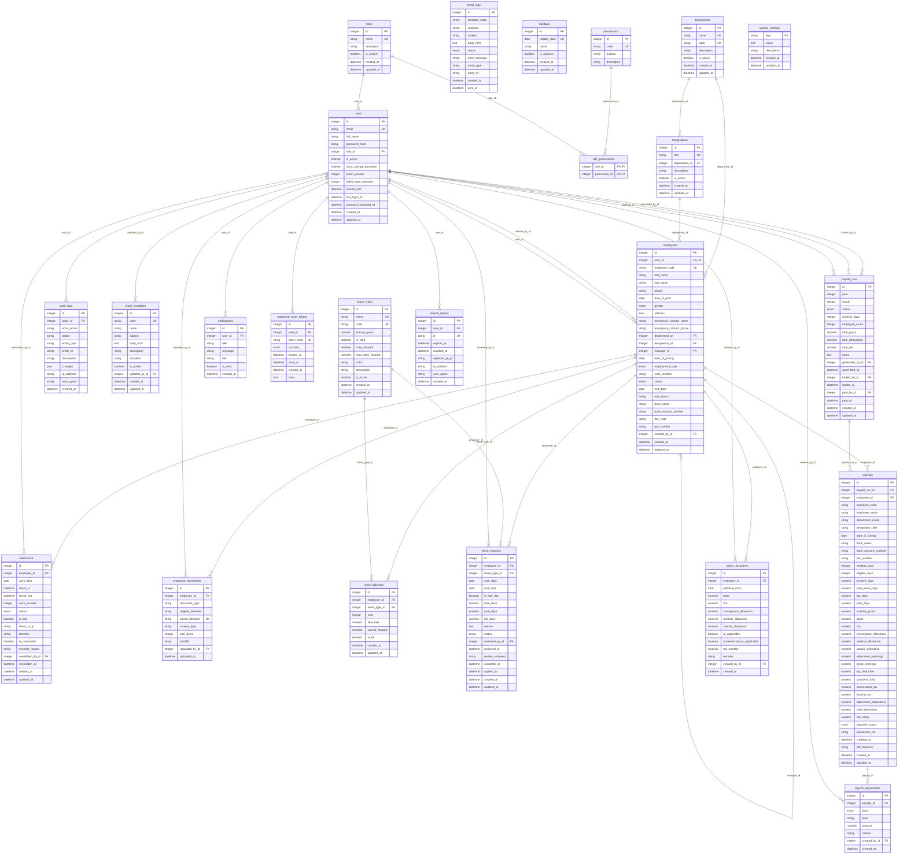

# HRMS - Entity Relationship Diagram

Generated from the SQLAlchemy models (`BackEnd/app/models`).

```mermaid
erDiagram
    departments {
        integer id PK
        string name UK
        string code UK
        string description
        boolean is_active
        datetime created_at
        datetime updated_at
    }
    email_logs {
        integer id PK
        string template_code
        string recipient
        string subject
        text body_html
        enum status
        string error_message
        string entity_type
        string entity_id
        datetime created_at
        datetime sent_at
    }
    holidays {
        integer id PK
        date holiday_date UK
        string name
        boolean is_optional
        datetime created_at
        datetime updated_at
    }
    leave_types {
        integer id PK
        string name UK
        string code UK
        numeric annual_quota
        boolean is_paid
        boolean carry_forward
        numeric max_carry_forward
        string color
        string description
        boolean is_active
        datetime created_at
        datetime updated_at
    }
    permissions {
        integer id PK
        string code UK
        string module
        string description
    }
    roles {
        integer id PK
        string name UK
        string description
        boolean is_system
        datetime created_at
        datetime updated_at
    }
    system_settings {
        string key PK
        text value
        string description
        datetime created_at
        datetime updated_at
    }
    designations {
        integer id PK
        string title UK
        integer department_id FK
        string description
        boolean is_active
        datetime created_at
        datetime updated_at
    }
    role_permissions {
        integer role_id PK,FK
        integer permission_id PK,FK
    }
    users {
        integer id PK
        string email UK
        string full_name
        string password_hash
        integer role_id FK
        boolean is_active
        boolean must_change_password
        integer token_version
        integer failed_login_attempts
        datetime locked_until
        datetime last_login_at
        datetime password_changed_at
        datetime created_at
        datetime updated_at
    }
    audit_logs {
        integer id PK
        integer actor_id FK
        string actor_email
        string action
        string entity_type
        string entity_id
        string description
        json changes
        string ip_address
        string user_agent
        datetime created_at
    }
    email_templates {
        integer id PK
        string code UK
        string name
        string subject
        text body_html
        string description
        string variables
        boolean is_active
        integer updated_by_id FK
        datetime created_at
        datetime updated_at
    }
    employees {
        integer id PK
        integer user_id FK,UK
        string employee_code UK
        string first_name
        string last_name
        string phone
        date date_of_birth
        enum gender
        text address
        string emergency_contact_name
        string emergency_contact_phone
        integer department_id FK
        integer designation_id FK
        integer manager_id FK
        date date_of_joining
        enum employment_type
        string work_location
        enum status
        date exit_date
        string exit_reason
        string bank_name
        string bank_account_number
        string ifsc_code
        string pan_number
        integer created_by_id FK
        datetime created_at
        datetime updated_at
    }
    notifications {
        integer id PK
        integer user_id FK
        string title
        string message
        string link
        boolean is_read
        datetime created_at
    }
    password_reset_tokens {
        integer id PK
        integer user_id FK
        string token_hash UK
        enum purpose
        datetime expires_at
        datetime used_at
        datetime created_at
        text note
    }
    payroll_runs {
        integer id PK
        integer year
        integer month
        enum status
        integer working_days
        integer employee_count
        numeric total_gross
        numeric total_deductions
        numeric total_net
        text notes
        integer generated_by_id FK
        datetime generated_at
        integer locked_by_id FK
        datetime locked_at
        integer paid_by_id FK
        datetime paid_at
        datetime created_at
        datetime updated_at
    }
    refresh_tokens {
        integer id PK
        integer user_id FK
        string jti UK
        datetime expires_at
        datetime revoked_at
        string replaced_by_jti
        string ip_address
        string user_agent
        datetime created_at
    }
    attendance {
        integer id PK
        integer employee_id FK
        date work_date
        datetime check_in
        datetime check_out
        integer work_minutes
        enum status
        boolean is_late
        string check_in_ip
        string remarks
        boolean is_overridden
        string override_reason
        integer overridden_by_id FK
        datetime overridden_at
        datetime created_at
        datetime updated_at
    }
    employee_documents {
        integer id PK
        integer employee_id FK
        string document_type
        string original_filename
        string stored_filename UK
        string content_type
        integer size_bytes
        string sha256
        integer uploaded_by_id FK
        datetime uploaded_at
    }
    leave_balances {
        integer id PK
        integer employee_id FK
        integer leave_type_id FK
        integer year
        numeric allocated
        numeric carried_forward
        numeric used
        datetime created_at
        datetime updated_at
    }
    leave_requests {
        integer id PK
        integer employee_id FK
        integer leave_type_id FK
        date start_date
        date end_date
        boolean is_half_day
        numeric total_days
        numeric paid_days
        numeric lop_days
        text reason
        enum status
        integer reviewed_by_id FK
        datetime reviewed_at
        string review_comment
        datetime cancelled_at
        datetime applied_at
        datetime created_at
        datetime updated_at
    }
    payslips {
        integer id PK
        integer payroll_run_id FK
        integer employee_id FK
        string employee_code
        string employee_name
        string department_name
        string designation_title
        date date_of_joining
        string bank_name
        string bank_account_masked
        string pan_number
        integer working_days
        integer eligible_days
        numeric present_days
        numeric paid_leave_days
        numeric lop_days
        numeric paid_days
        numeric monthly_gross
        numeric basic
        numeric hra
        numeric conveyance_allowance
        numeric medical_allowance
        numeric special_allowance
        numeric adjustment_earnings
        numeric gross_earnings
        numeric lop_deduction
        numeric provident_fund
        numeric professional_tax
        numeric income_tax
        numeric adjustment_deductions
        numeric total_deductions
        numeric net_salary
        enum payment_status
        string transaction_ref
        datetime credited_at
        string pdf_filename
        datetime created_at
        datetime updated_at
    }
    salary_structures {
        integer id PK
        integer employee_id FK
        date effective_from
        numeric basic
        numeric hra
        numeric conveyance_allowance
        numeric medical_allowance
        numeric special_allowance
        boolean pf_applicable
        boolean professional_tax_applicable
        numeric tds_monthly
        string remarks
        integer created_by_id FK
        datetime created_at
    }
    payroll_adjustments {
        integer id PK
        integer payslip_id FK
        enum kind
        string label
        numeric amount
        string reason
        integer created_by_id FK
        datetime created_at
    }
    departments ||--o{ designations : "department_id"
    departments ||--o{ employees : "department_id"
    designations ||--o{ employees : "designation_id"
    employees ||--o{ attendance : "employee_id"
    employees ||--o{ employee_documents : "employee_id"
    employees ||--o{ employees : "manager_id"
    employees ||--o{ leave_balances : "employee_id"
    employees ||--o{ leave_requests : "employee_id"
    employees ||--o{ payslips : "employee_id"
    employees ||--o{ salary_structures : "employee_id"
    leave_types ||--o{ leave_balances : "leave_type_id"
    leave_types ||--o{ leave_requests : "leave_type_id"
    payroll_runs ||--o{ payslips : "payroll_run_id"
    payslips ||--o{ payroll_adjustments : "payslip_id"
    permissions ||--o{ role_permissions : "permission_id"
    roles ||--o{ role_permissions : "role_id"
    roles ||--o{ users : "role_id"
    users ||--o{ attendance : "overridden_by_id"
    users ||--o{ audit_logs : "actor_id"
    users ||--o{ email_templates : "updated_by_id"
    users ||--o{ employee_documents : "uploaded_by_id"
    users ||--o{ employees : "created_by_id"
    users ||--o{ leave_requests : "reviewed_by_id"
    users ||--o{ notifications : "user_id"
    users ||--o{ password_reset_tokens : "user_id"
    users ||--o{ payroll_adjustments : "created_by_id"
    users ||--o{ payroll_runs : "generated_by_id"
    users ||--o{ payroll_runs : "locked_by_id"
    users ||--o{ payroll_runs : "paid_by_id"
    users ||--o{ refresh_tokens : "user_id"
    users ||--o{ salary_structures : "created_by_id"
    users ||--o| employees : "user_id"
```
